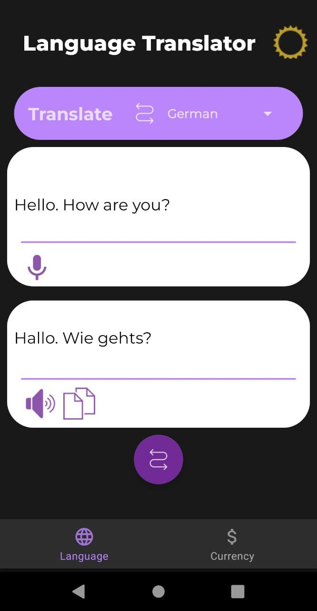
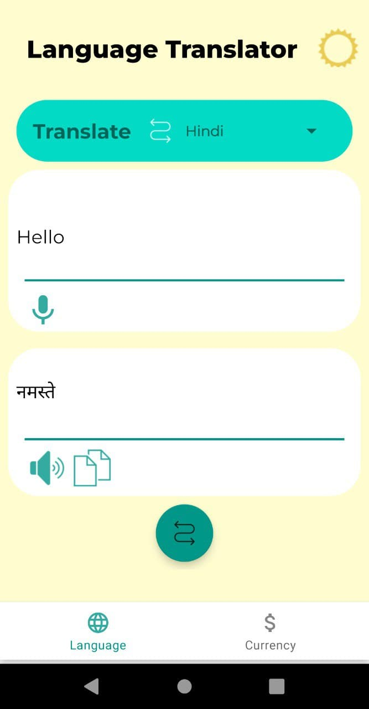
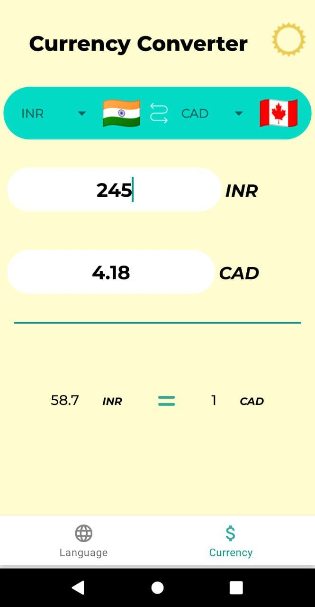
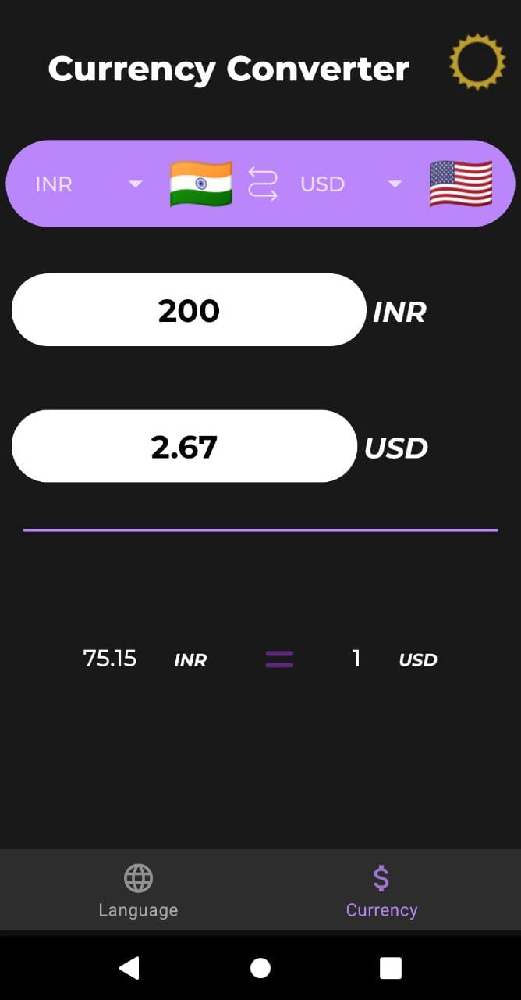
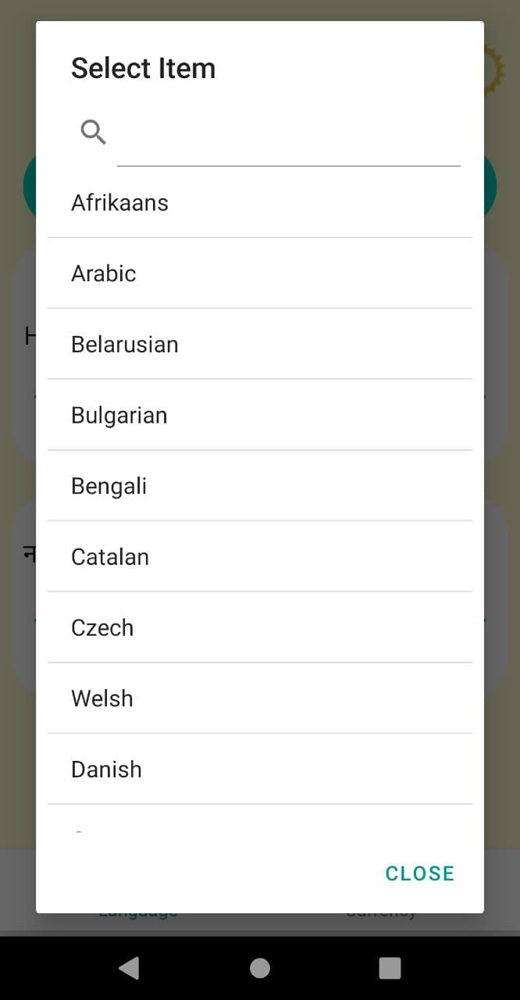
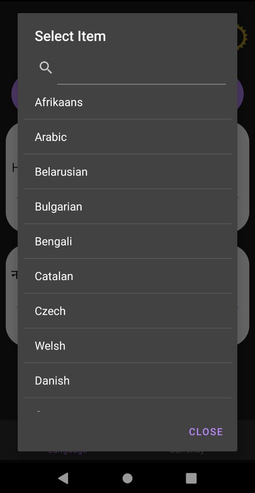

# Traveller's Toolkit

## About

* Android app for currency conversion and language translation.
___

## What's new in v2

* Clean architechture
* Speech to text and text to speech translations
* Dependency injection
* [Searchable Spinner](https://github.com/miteshpithadiya/SearchableSpinner)
* Better UI with splash screen

___

## Features

* Conversion support for more than **170** currencies.
* Translation support for more than **50** languages.
* **Offline** translation available, once a language model is downloaded.
* User can switch between **Dark** and **Light** theme.
* Text to speech translation.
* Speech to text translation.
___

## Permissions Required

* Internet
* Record Audio

## Screenshots

<table>
  <tr>
    <td></td>
    <td></td>

  </tr>
    <tr>
    <td></td>
    <td></td>

  </tr>
   <tr>
    <td></td>
    <td></td>
    </td>
  </tr>

 </table>

___

## Technologies Used

* [Kotlin](https://kotlinlang.org/docs/home.html)
* [Java](https://docs.oracle.com/en/java/)
* [Retrofit](https://square.github.io/retrofit/)
* [Coroutines](https://developer.android.com/kotlin/coroutines)
* [Gson](https://github.com/google/gson)
* [Exchange Rates API](https://exchangerate.host/#/#our-services)
* [Language Detection | ML Kit by Google]()
* [Translation | ML Kit by Google](https://developers.google.com/ml-kit/language/translation/android)
* [Dagger Hilt](https://developer.android.com/training/dependency-injection/hilt-android)

___

## Compatibilty

* Android (API level 19) and higher

___

## Licensing

* Conversion Buddy is licensed under the MIT License. See [LICENSE](https://github.com/sreshtha10/ConversionBuddy/blob/master/LICENSE) for the full license text.

